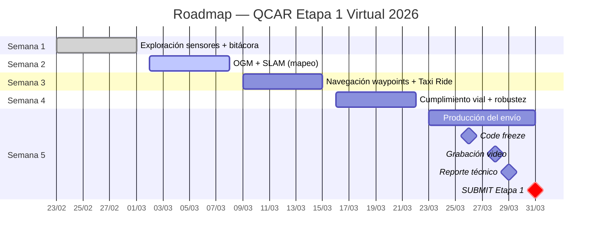

# Vehículos Autónomos — QCar

Documentación técnica del proyecto de conducción autónoma con el **Quanser QCar**, orientado a la competencia universitaria **Quanser Self-Driving Car Student Competition 2026**. El trabajo incluye exploración de sensores, mapeo SLAM, navegación por waypoints y cumplimiento de reglas de tráfico.

---

## Etapas de la competencia

| Etapa | Modalidad | Fecha límite |
|-------|-----------|-------------|
| Etapa 1 | Virtual (video + reporte técnico) | 31 mar 2026 |
| Etapa 2 | Presencial (campus seleccionado) | 11–14 may 2026 |

---

## Roadmap semanal

<table class="roadmap-table">
  <thead>
    <tr>
      <th>Semana</th>
      <th>Período</th>
      <th>Objetivo principal</th>
      <th>Estado</th>
    </tr>
  </thead>
  <tbody>
    <tr>
      <td><strong>S1</strong></td>
      <td>23 feb – 1 mar</td>
      <td>Exploración sensores + bitácora inicial</td>
      <td>✓ Completado</td>
    </tr>
    <tr>
      <td><strong>S2</strong></td>
      <td>2 mar – 8 mar</td>
      <td>OGM + SLAM (mapeo del entorno)</td>
      <td>⚡ Activo</td>
    </tr>
    <tr>
      <td><strong>S3</strong></td>
      <td>9 mar – 15 mar</td>
      <td>Navegación por waypoints + Taxi Ride</td>
      <td>Pendiente</td>
    </tr>
    <tr>
      <td><strong>S4</strong></td>
      <td>16 mar – 22 mar</td>
      <td>Cumplimiento vial + robustez</td>
      <td>Pendiente</td>
    </tr>
    <tr>
      <td><strong>S5</strong></td>
      <td>23 mar – 31 mar</td>
      <td>Producción del envío (video, reporte, submission)</td>
      <td>Pendiente</td>
    </tr>
  </tbody>
</table>

---

## Diagrama Gantt

---

## Entregables por semana

**Semana 1** (23 feb – 1 mar)
- [x] Configuración del entorno virtual (QUARC/Simulink)
- [x] Pruebas de sensores: cámara, LiDAR, IMU, encoders
- [x] Bitácora — Punto 1: Exploración del entorno y sensores

**Semana 2** (2 mar – 8 mar)
- [x] Implementación de OGM (Occupancy Grid Map)
- [ ] SLAM — integración lidar + odometría
- [ ] Bitácora — Punto 2: Mapeo

**Semana 3** (9 mar – 15 mar)
- [ ] Planeación de trayectorias A\* / RRT
- [ ] Módulo Taxi Ride (pick-up + drop-off)
- [ ] Bitácora — Punto 3: Navegación

**Semana 4** (16 mar – 22 mar)
- [ ] Detección de semáforos y señales de tráfico
- [ ] Pruebas de robustez y repetibilidad
- [ ] Bitácora — Punto 4: Cumplimiento vial

**Semana 5** (23 mar – 31 mar)
- [ ] Edición y grabación del video de demostración (≤ 3 min)
- [ ] Redacción del reporte técnico final
- [ ] Revisión final y submission → **31 mar 2026**

---

## Bitácora de avances

- [Todos los avances](./avances/)
- [Punto 1 — Exploración del entorno y sensores](./avances/punto-1-entorno-y-sensores)
